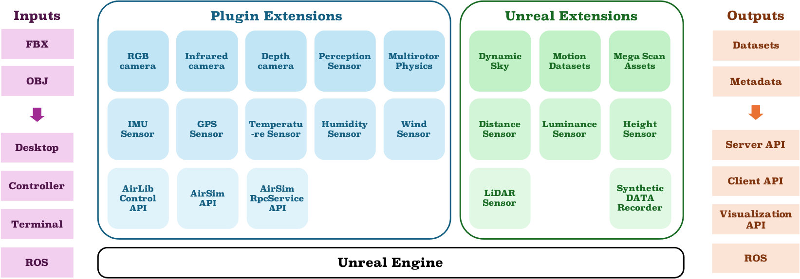
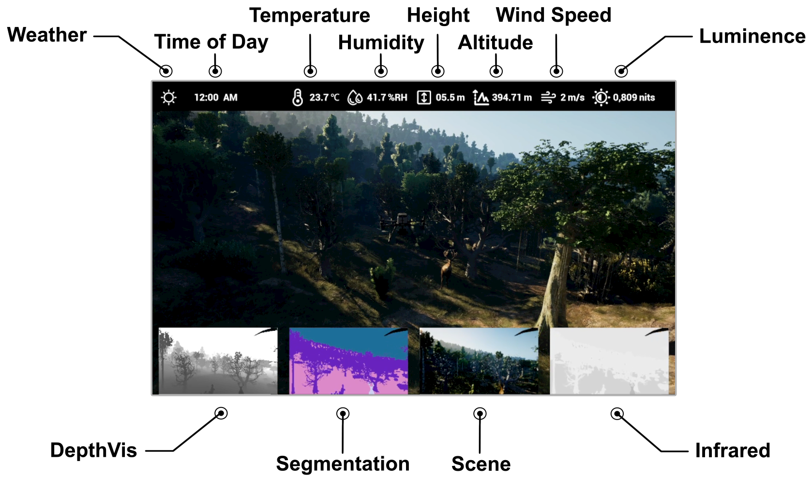

## SimUAVs-A UAV Telepresence Simulation Platform with Multi-agent Sensing and Dynamic Environment

##### Feilin Han$^1$, Leping Zhang$^1$, Xin Wang$^2$, Ke-Ao Zhao$^1$,<br>Ying Zhong$^1$, Ziyi Su$^1$, Tongtong Feng$^2$, Wenwu Zhu$^2$$^∗$

#### $^1$ Department of Film and TV Technology, Beijing Film Academy<br>$^2$ Department of Computer Science and Technology, Tsinghua University

---


##### Abstract

<div style="text-align: justify;">
Unmanned Aerial Vehicles (UAVs) are necessary across diverse domains, including disaster surveillance and wildlife conservation. However, the development and evaluation of UAV-related algorithms often encounter a significant hurdle: the scarcity of authentic training data. In this paper, we introduce SimUAVs, a telepresence simulation platform with a dynamic environment, serving as a realistic synthetic data generation, performance evaluation, and visualization tool for multi-agent collaboration learning. This paper presents the architecture, features, and capabilities of SimUAVs. Leveraging Unreal Engine (UE), AirSim APIs, and ROS (Robot Operating System), our platform enables realistic simulations, mirroring real-world conditions and facilitating research in UAV technology.
</div>


<center>
Figure 1. The showcase of multi-agents and dynamic environment in SimUAVs.
</center>

<br>

<div style="text-align: justify;">
SimUAVs is a telepresence simulation platform for UAV synthetic data generation. This system provides multiple agents and multi-modal sensors for manipulation, with dynamic real-world weather and environment conditions for emulation. Depending on the scope of the simulation, SimUAVs is integrated with multiple sensor plugins and extensions, shown in Figure 2, to implement perception sensors, a UAV control module, a dynamic weather module, and 3D scene construction.
</div>



<center>
Figure 2. The framework of SimUAVs
</center>

<br>

<div style="text-align: justify;">
The simulation environment is based on the physical computation and image rendering process of the Unreal Engine, and the construction of the simulation scene is completed through model files output by external DCC software such as FBX or OBJ. SimUAV, as an independent plugin of UE, can obtain rendering information, the position of drones, sensor data, and commands in real time. 
</div>

<br>
<div style="text-align: justify;">
The synthetic system can export metadata files and image sequences, with a maximum frame rate of 60 fps, and communicate with a server for data processing, learning, and management timely. The HUD (Head-Up Display) interface, shown in Figure 3, which is designed for monitoring and data visualization.
</div>



<center>
Figure 3. The Head-Up Display interface of SimUAVs
</center>

<br>

<div style="text-align: justify;">
SimUAVs is designed to support the research and development of UAVs, enhancing the realism and effectiveness of simulations. This platform not only facilitates the generation of realistic synthetic data but also provides a comprehensive tool for evaluation and visualization in multi-agent learning. In the future, additional plugins and extensions will be integrated into this framework as needed. We would like to develop FPGA-based hardware-in-the-loop simulations for real-time virtual-reality-fusion systems. 
</div>


---
<!-- 
##### Citation

Unterholzer, Detlev A., and  Moritz-Maria von Igelfeld. 2013. "Unusual Uses For Olive Oil." *Journal of Oleic Science* 34 (1): 449–489. http://www.alexandermccallsmith.com/book/unusual-uses-for-olive-oil.

```BibTeX
@article{UI13,
author = {Detlev A. Unterholzer and Moritz-Maria von Igelfeld},
year = {2013},
title ={Unusual Uses For Olive Oil},
journal = {Journal of Oleic Science},
volume = {34},
number = {1},
pages = {449--489},
url = {http://www.alexandermccallsmith.com/book/unusual-uses-for-olive-oil}}
```

 -->


##### ACKNOWLEDGMENT

This work was supported by THU-Beijing National Research Center Open Research Project.


##### Related material

<!-- + [Paper](paper1.pdf) -->
+ [Video](https://youtu.be/G_fpFyRQBt0)
<!-- + [Code and data](https://github.com/pmichaillat/u-star) -->

---