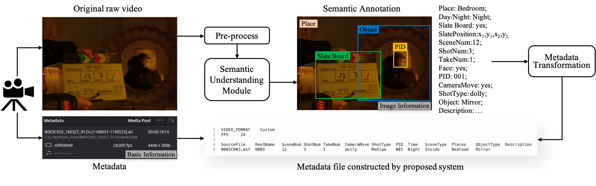
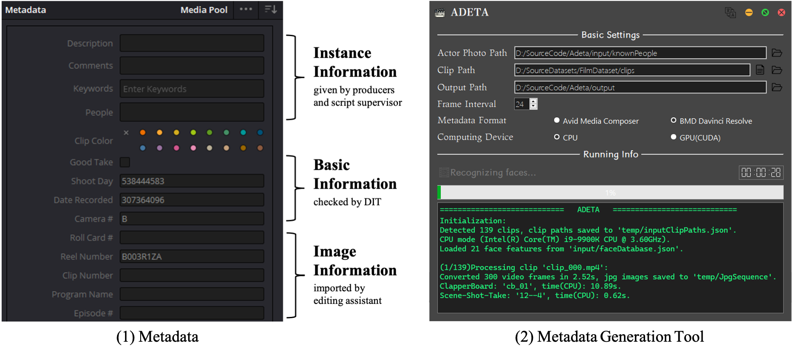
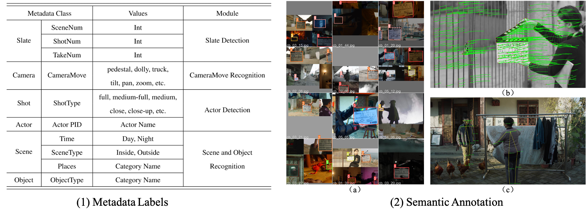
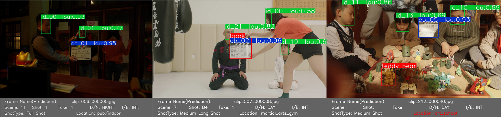
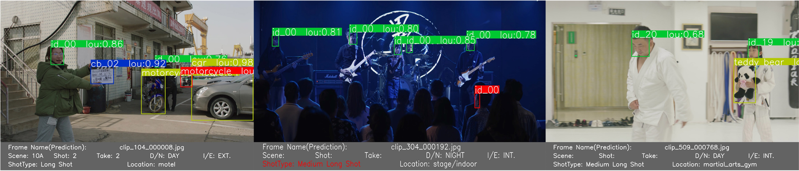

## A Metadata Generation System with Semantic Understanding for Video Retrieval in Film Production

##### Feilin Han$^∗$, Zhaoxu Meng

#### Department of Film and TV Technology, Beijing Film Academy

---

<!-- <div style="text-align: justify;">

</div> -->

##### Abstract

<div style="text-align: justify;">
In film production, metadata plays an important role in original raw video indexing and classification within the industrial post-production software. Inspired by deep visual-semantic methods, we propose an automated image information extraction process to extend the diversity of metadata entities for massive large-scale raw video searching and retrieval. In this paper, we introduce the proposed system architecture and modules, integrating semantic annotation models and user-demand-oriented information fusion. We conducted experiments to validate the effectiveness of our system on Film Raw Video Semantic Annotation Dataset (Film-RVSAD) and Slate Board Template Dataset (SBTD), two benchmark datasets built for cinematography-related semantic annotation and slate detection. Experimental results show that the proposed system provides an effective strategy to improve the efficiency of metadata generation and transformation, which is necessary and convenient for collaborative work in the filmmaking process.
</div>

<br>


<center>
Figure 1. The framework of metadata generation system.
</center>


<br>

<div style="text-align: justify;">
In this work, we propose a metadata extraction system, which is embedded with semantic understanding and video content analysis, aiming for user-demand-oriented search and raw video retrieve. This system could format the metadata according to the user demand and specialized post-production software, and attach it to the basic information recorded by the camera. The metadata example and user interface of our metadata generation system is shown in Figure 2.

</div>


<center>
Figure 2. Example of metadata and system user interface.
</center>

<br>

<div style="text-align: justify;">
For validating the proposed strategy, we conducted experiments to evaluate the efficiency of our system and the performance of generated metadata. The experimental configuration is an integration of Slate Detection, CameraMove Recognition, Actor Detection, and Scene and Object Recognition modules, with a graphical user interface. To quantitatively evaluate our system, we built a benchmark datasets, named Film Raw Video Semantic Annotation Dataset (Film-RVSAD), shown in Figure 3, for cinematography-related information extraction with metadata semantic labels. Figure 3 alsos gives experimental examples of slate detection, camera movement recognition, and shot scale recognition in our framework.

</div>



<center>
Figure 3. Metadata labels and experimental results in Film-RVSAD.
</center>


<br>


<div style="text-align: justify;">
Our system fuses user-demand-oriented information into the final metadata information, where allows users to choose the labels they need and the file format that their post-production software could read. The user interface is shown as Figure~\ref{fig:ui}. After parsing the basic information from the original metadata, we will add up the extracted metadata labels or re-construct a new metadata file to extend the diversity of semantic descriptions. All the metadata information can be automatically loaded for classify and index corresponding videos in video management and retrieval.

</div>



<center>
Figure 4. Examples of region predictions and semantic annotations on Film-RVSAD.
</center>


<br>

<div style="text-align: justify;">
We introduced an application scenario of browsing the massive large-scale raw videos with the help of metadata. In this paper, we propose an automated method with semantic understanding for raw video search and retrieval. Our system utilizes deep visual-semantic models to extract cinematography-related image information, which can be integrated into metadata labels. We conducted experiments to validate the effectiveness of our system. We showed that the proposed system provides an applicable metadata extraction strategy, generating semantic annotations in terms of user demand, to improve the efficiency of video retrieval in film production.

</div>


---
<!-- 
##### Citation

Unterholzer, Detlev A., and  Moritz-Maria von Igelfeld. 2013. "Unusual Uses For Olive Oil." *Journal of Oleic Science* 34 (1): 449–489. http://www.alexandermccallsmith.com/book/unusual-uses-for-olive-oil.

```BibTeX
@article{UI13,
author = {Detlev A. Unterholzer and Moritz-Maria von Igelfeld},
year = {2013},
title ={Unusual Uses For Olive Oil},
journal = {Journal of Oleic Science},
volume = {34},
number = {1},
pages = {449--489},
url = {http://www.alexandermccallsmith.com/book/unusual-uses-for-olive-oil}}
```

 -->


##### ACKNOWLEDGMENT

This work was supported by Beijing Natural Science Foundation (No. 4214073) and the National Social Science Fundation Art Project (No. 20BC040). Special thanks to all the cast and crew from \textit{Nian Nian}, \textit{The Deep Blue}, \textit{Spring in the Hood}, \textit{MiLaZhiGe}, \textit{YueShi}, \textit{TianMingYiFuChouJi} for generously offering original raw videos to support our research.


##### Related material

+ [Paper](ICVRV2022-camera-ready.pdf)
<!-- + [Poster](Poster_2201_icme2024.pdf) -->
<!-- + [Code and data](https://github.com/pmichaillat/u-star) -->

---