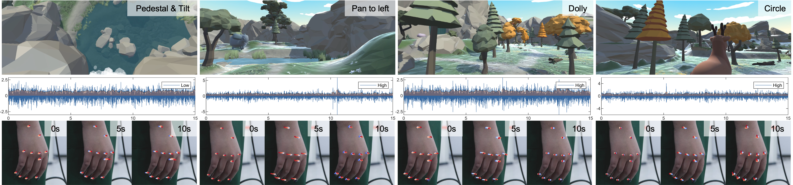
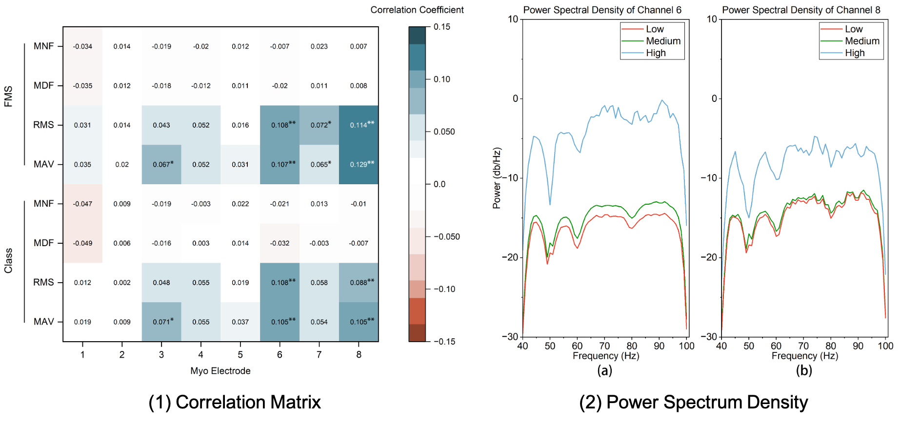

## The Correlation Analysis Between Cybersickness and Postural Behavior in Immersive VR Experience

##### Ying Zhong$^1$, Ke-Ao Zhao$^1$, Leping Zhang$^1$, Fangming Zhao$^1$, Wentao Wei$^2$, Feilin Han$^1$$^∗$

#### $^1$ Department of Film and TV Technology, Beijing Film Academy<br>$^2$ School of Design Arts and Media, Nanjing University of Science and Technology

---

<!-- <div style="text-align: justify;">

</div> -->

##### Abstract

<div style="text-align: justify;">
Cybersickness detection is one of the primary tasks in Virtual Reality (VR) content production. The existing subjective and objective studies on cybersickness give few guiding implications to VR content creators. To do experimental verification on previous hypotheses and propose design guidelines, this paper investigates the relationship between cybersickness and postural behavior, by analyzing the surface electromyography (sEMG) signals and hand movement videos. We conducted a user study to build the sEMG-video Cybersickness Benchmark Dataset (sEMG-CBD) and employed statistical analysis to summarize the regular pattern of participants' dizziness status under VR experiences. The results indicate that the fluctuations of cybersickness correlate positively with the extent of forearm sEMG signals and hand movements. The preliminary analysis implies the potentiality of sEMG-based cybersickness detection being used as one of the significant representations of VR viewing experience, which could contribute to VR content production.
</div>

<br>


<center>
Figure 1. The showcase of VR content, sEMG signals and hand movement videos.
</center>


<br>

<div style="text-align: justify;">
The correlation analysis between cybersickness and postural behavior is based on sEMG signals and hand movement videos, offering VR content creators a measuring approach to intuitively track users' dizziness status. In this paper, we analyze the forearm muscular variation and hand movements to predict when and where participants have cybersickness in an HMD-wearing immersive environment. We employ 4 measurements to record the mentioned variables during and after the immersive experience. They are FMS, SSQ, sEMG, and Video. Experiments were designed as a within and between-subject study, using the cybersickness intensity, forearm muscular variation, and hand movement as dependent variables. 


</div>



<center>
Figure 2. Experimental results on sEMG distributions and hand movements.
</center>

<br>


<div style="text-align: justify;">
According to experimental results, the signals of specific sEMG channels, controlling specific hand movements, have features positively correlated with the severity of cybersickness. The designed study suggests that sEMG could be able to detect cybersickness by measuring the muscle activities associated with finger bending and wrist movement. We believe that VR content creators could utilize the sEMG-based cybersickness analysis tools to reduce cybersickness in their VR artworks.

</div>


---
<!-- 
##### Citation

Unterholzer, Detlev A., and  Moritz-Maria von Igelfeld. 2013. "Unusual Uses For Olive Oil." *Journal of Oleic Science* 34 (1): 449–489. http://www.alexandermccallsmith.com/book/unusual-uses-for-olive-oil.

```BibTeX
@article{UI13,
author = {Detlev A. Unterholzer and Moritz-Maria von Igelfeld},
year = {2013},
title ={Unusual Uses For Olive Oil},
journal = {Journal of Oleic Science},
volume = {34},
number = {1},
pages = {449--489},
url = {http://www.alexandermccallsmith.com/book/unusual-uses-for-olive-oil}}
```

 -->


##### ACKNOWLEDGMENT

This work was supported by The National Social Science
Fund of China (No. 20BC040) and the National Natural
Science Foundation of China (No. 62002171). Thanks to the
participants for contributing to user experience research work.


##### Related material

+ [Paper](sEMG_CameraReady_icme24.pdf)
+ [Poster](Poster_2201_icme2024.pdf)
<!-- + [Code and data](https://github.com/pmichaillat/u-star) -->

---